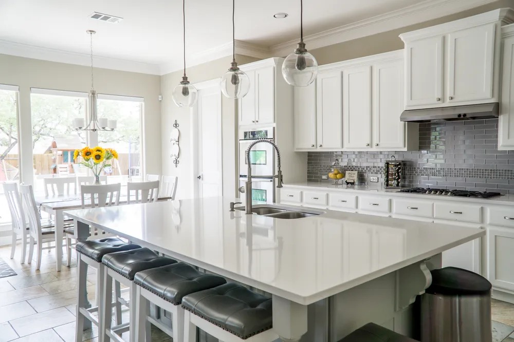
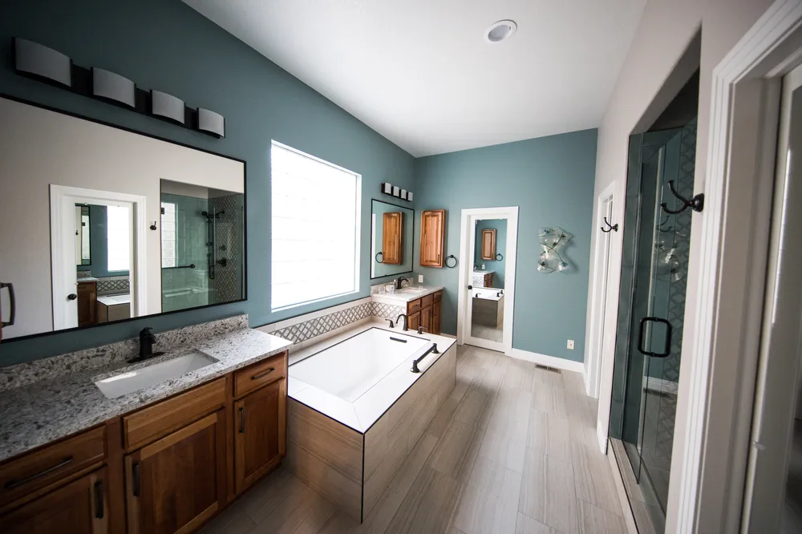

# GatsbyJS 3.5 (Static site generator) + Airtable + Algolia Search

### Pet-project website built with Gatsby v3.5 & Airtable Backend & Algolia Search

## [DEMO link of Frontend](https://gatsby-v3-airtable.netlify.app) deployed on Netlify

- Backend for Content => [Airtable](https://airtable.com/) + [Algolia](https://www.algolia.com/)
- [Frontend](https://gatsby-v3-airtable.netlify.app) deployed on Netlify => CI/CD

> [localhost:8000](http://localhost:8000) version of Frontend requires:
>
> - [Airtable](https://airtable.com/) Backend
> - [Algolia](https://www.algolia.com/) Backend

---

- [Gatsby 3.0](https://www.gatsbyjs.com)
- [Quick Start](https://www.gatsbyjs.com/docs/quick-start)
- [Gatsby Starters](https://www.gatsbyjs.com/starters/?v=3)
- [Hello world starter](https://www.gatsbyjs.com/starters/gatsbyjs/gatsby-starter-hello-world/)
- [Gatsby Plugin Library](https://www.gatsbyjs.com/plugins/)
- [React icons](https://react-icons.github.io/react-icons/)
- [gatsby-plugin-image](https://www.gatsbyjs.com/plugins/gatsby-plugin-image)
- [Migrating from gatsby-image to gatsby-plugin-image](https://www.gatsbyjs.com/docs/reference/release-notes/image-migration-guide/)
- [Gatsby Image plugin](https://www.gatsbyjs.com/docs/reference/built-in-components/gatsby-plugin-image/#restrictions-on-using-staticimage)
- [Getting Started with Gatsby](https://strapi.io/documentation/developer-docs/latest/developer-resources/content-api/integrations/gatsby.html#create-a-gatsby-app)
- [prop-types](https://www.npmjs.com/package/prop-types)
- [gatsby-plugin-react-helmet](https://www.gatsbyjs.com/plugins/gatsby-plugin-react-helmet/)
- [Adding an Seo Component](https://www.gatsbyjs.com/docs/add-seo-component/)
- **_[Pexels stock photos](https://www.pexels.com/)_**
- **_[Completely Free online photo editing](https://www10.lunapic.com/editor/)_**
- [Favicon](https://favicon.io/favicon-generator/)
- [Inkscape](https://inkscape.org/release/inkscape-1.0.2/)
- [Adalo no code app builder](https://www.adalo.com) [help](https://help.adalo.com)
- [Airtable.js](https://www.npmjs.com/package/airtable)
- [gatsby-background-image](https://www.gatsbyjs.com/plugins/gatsby-background-image/)
- [Tables Generator: LaTeX HTML Text Markdown](https://www.tablesgenerator.com/markdown_tables)
- [Adding Search with Algolia](https://www.gatsbyjs.com/docs/adding-search-with-algolia/)
- [Gatsby plugin Algolia](https://www.gatsbyjs.com/plugins/gatsby-plugin-algolia-search/)
- [Algolia InstantSearch.js Widgets](https://www.algolia.com/doc/api-reference/widgets/js/)
- [Next Generation Routing for React](https://www.npmjs.com/package/@reach/router) - React 17 => ERROR => import { useLocation } from "@reach/router"
- [Location Data from Props](https://www.gatsbyjs.com/docs/location-data-from-props/)
- [@reach/router and Gatsby](https://www.gatsbyjs.com/docs/reach-router-and-gatsby/)
- [@gatsbyjs/reach-router ... THIS IS A FORK TO BE COMPATIBLE WITH REACT 17](https://www.npmjs.com/package/@gatsbyjs/reach-router?activeTab=readme)

---

Requirements:

- [Node.js](https://nodejs.org/uk/) - development
- [Airtable](https://airtable.com) - Headless CMS (for data storage)
- [Airtable.js](https://www.npmjs.com/package/airtable)
- [Algolia](https://www.algolia.com/) - Search & Discovery platform (for input field search)
- [Netlify](https://www.netlify.com) - static site deployment

---

### Run in terminal

```
npm i
```

### Or install Gatsby project manually:

```
npm i -g gatsby-cli
gatsby --version
npm install -g npm@7.10.0
gatsby new gatsby-starter-default https://github.com/gatsbyjs/gatsby-starter-default
gatsby clean
gatsby develop
```

### Check the result:

- [localhost:8000](http://localhost:8000)
- [localhost:8000/\_\_\_graphql](http://localhost:8000/___graphql)

---

## Global styles

with styled-components (without using [global.css](src/components/global.css)) are in [`root-wrapper.js`](root-wrapper.js) file

wrapped in rootElement

```jsx
export const wrapRootElement = ({ element }) => (
  <>
    <GlobalStyle />
    {element}
  </>
)
```

## Background Image on Homepage

[gatsby-background-image](https://www.gatsbyjs.com/plugins/gatsby-background-image/)

Get background image from `images` folder using GraphQL query

```
const query = graphql`
  {
    file(relativePath: {eq: "slider-bg.jpg"}) {
      childImageSharp {
        fluid {
          src
        }
      }
    }
  }
`
```

Paste it to [`<Background/>` component](src/components/Background.js)

---

# [Airtable](https://airtable.com) - Headless CMS

- [Free plan](https://airtable.com/pricing) includes

  - Unlimited bases
  - 1,200 records per base
  - 2 GB of attachments per base
  - Grid, calendar, kanban, form, & gallery views

- Add a workspace
- Create Base => Grid view => rename columns to lowercase => create new table => [ProjectsSection](src/constants/dataTable-ProjectsSection.csv):

  | name               |                        image                         |                      type                       |    date    |
  | :----------------- | :--------------------------------------------------: | :---------------------------------------------: | :--------: |
  | (single line text) |                     (attachment)                     | (single select): - bathroom - bedroom - kitchen |   (date)   |
  | modern kitchen     |    |                     kitchen                     | 05/10/2021 |
  | outside bathroom   |  |                    bathroom                     | 01/01/2021 |
  | comfy bedroom      |    |                     bedroom                     | 10/10/2020 |
  | vintage kitchen    |    |                     kitchen                     | 01/05/2020 |
  | classic bathroom   |  |                    bathroom                     | 05/10/2020 |
  | retro bathroom     |  |                    bathroom                     | 15/10/2020 |

- Help => API Documentation => INTRODUCTION => The ID of this base is `appScClgH*******`
- Account => Generate API key => `keyYnbZx*********` => copy / paste to `.env.development` & `.env.production`:

```
GATSBY_AIRTABLE_API=keyYnbZxCJ****

GATSBY_AIRTABLE_BASE_ID=appScClgH****
```

- add code to [gatsby-config.js](gatsby-config.js):

```
    {
      resolve: `gatsby-source-airtable`,
      options: {
        apiKey: process.env.GATSBY_AIRTABLE_API,
        concurrency: 5,
        tables: [
          {
            baseId: process.env.GATSBY_AIRTABLE_BASE_ID,
            tableName: `ProjectsSection`,
            mapping: { image: `fileNode` },
          },
        ],
      },
    },
```

- generate GraphQL query:

```
export const query = graphql`
  {
    allAirtable(
      filter: {table: {eq: "ProjectsSection"}}
      limit: 3
      sort: {fields: data___date, order: DESC}
    ) {
      nodes {
        id
        data {
          date
          name
          type
          image {
            localFiles {
              childImageSharp {
                fluid {
                  src
                }
              }
            }
          }
        }
      }
    }
  }
`
```

- render [Projects](src/components/Projects.js) component

---

- Create Base => Grid view => rename columns to lowercase => create new table => [ReviewSection](src/constants/dataTable-ReviewSection.csv):

| name      |                      image                       | quote                                                                                                                                                       | title  |
| :-------- | :----------------------------------------------: | :---------------------------------------------------------------------------------------------------------------------------------------------------------- | ------ |
| Mr. Dog   |  | We have two lives, and the second begins when we realize we only have one. - Confucius                                                                      | Senior |
| Doggy Dog |  | Words are, in my not-so-humble opinion, our most inexhaustible source of magic. Capable of both inflicting injury, and remedying it. - Professor Dumbledore | Middle |
| True Dog  |  | It is impossible to begin to learn that which one thinks one already knows. - Epictetus                                                                     | Junior |

- add code to [gatsby-config.js](gatsby-config.js):
- generate GraphQL query:

```
{
  resolve: `gatsby-source-airtable`,
  options: {
    apiKey: process.env.GATSBY_AIRTABLE_API,
    concurrency: 5,
    tables: [
      {
        baseId: process.env.GATSBY_AIRTABLE_BASE_ID,
        tableName: `ProjectsSection`,
        mapping: { image: `fileNode` },
      },
      {
        baseId: process.env.GATSBY_AIRTABLE_BASE_ID,
        tableName: `ReviewSection`,
        mapping: { image: `fileNode` },
      },
    ],
  },
},
```

```
const query = graphql`
  {
    allAirtable(filter: { table: { eq: "ReviewSection" } }) {
      nodes {
        data {
          title
          name
          image {
            localFiles {
              childImageSharp {
                fixed(width: 150, height: 150) {
                  ...GatsbyImageSharpFixed
                }
              }
            }
          }
          quote
        }
      }
    }
  }
`
```

- render [Slider](src/components/Slider.js) component

---

## Hero Slider

We pass Airtable images like in The Latest Projects Section to [Hero](src/components/Hero.js) component =>
[Background](src/components/Background.js) component instead of Local background image file

---

## Survey section

Requires [Airtable.js](https://www.npmjs.com/package/airtable) package

Dynamically rendered data (fetch the data when [Survey](src/components/Survey.js) component renders ), updated from Airtable Backend:

- Create Base => Grid view => rename columns to lowercase => create new table => [SurveySection](src/constants/dataTable-SurveySection.csv):

| name     | votes |
| :------- | :---: |
| kitchen  |  10   |
| bathroom |  50   |
| bedroom  |   5   |

---

# [ALGOLIA](https://www.algolia.com/) - the flexible AI-powered Search & Discovery platform

- [Free plan](https://www.algolia.com/account/plan/) includes

  - UP TO 10 UNITS / MONTH
  - The Free Plan requires you to display the Algolia logo next to the search results.
  - [Documentation](https://www.algolia.com/doc/)

- Create a new index => `ProjectsPageSearch`
- Dashboard => Sidebar menu => [API Keys](https://www.algolia.com/apps/********/api-keys/all) => copy / paste to `.env.development` & `.env.production`:

```
GATSBY_ALGOLIA_INDEX_NAME=ProjectsPageSearch
GATSBY_ALGOLIA_APP_ID=DQVJ*******
GATSBY_ALGOLIA_SEARCH_KEY=3a82e752***********
GATSBY_ALGOLIA_ADMIN_KEY=3b4a8aa28***********
```

- Setup [gatsby-config.js](gatsby-config.js):

```
    {
      resolve: `gatsby-plugin-algolia`,
      options: {
        appId: process.env.GATSBY_ALGOLIA_APP_ID,
        apiKey: process.env.GATSBY_ALGOLIA_ADMIN_KEY,
        indexName: process.env.GATSBY_ALGOLIA_INDEX_NAME,
        queries: queries: require("./src/constants/algolia"),
        chunkSize: 10000,
      },
    },
```

- Run (will push the data from [query](src/constants/algolia.js) to [Algolia](https://www.algolia.com/apps/*******/explorer/browse/ProjectsPageSearch)):

```
gatsby clean && gatsby build
```

- Dashboard => Sidebar menu => [Indices](https://www.algolia.com/apps/*******/explorer/indices) => `Your data has been successfully imported. You can use the search bar to consult and manage your records...`

- Create [React InstantSearch](https://www.algolia.com/doc/guides/building-search-ui/what-is-instantsearch/react/) in [Algolia component](src/components/Algolia.js)

- [Algolia InstantSearch.js Widgets](https://www.algolia.com/doc/api-reference/widgets/js/) => [searchBox](https://www.algolia.com/doc/api-reference/widgets/search-box/js/) => HTML Output structure:

```html
<div class="ais-SearchBox">
  <form class="ais-SearchBox-form" novalidate>
    <input
      class="ais-SearchBox-input"
      autocomplete="off"
      autocorrect="off"
      autocapitalize="off"
      placeholder="Search for products"
      spellcheck="false"
      maxlength="512"
      type="search"
      value=""
    />
    <button
      class="ais-SearchBox-submit"
      type="submit"
      title="Submit the search query."
    >
      <svg
        class="ais-SearchBox-submitIcon"
        xmlns="http://www.w3.org/2000/svg"
        width="10"
        height="10"
        viewBox="0 0 40 40"
      >
        ...
      </svg>
    </button>
    <button
      class="ais-SearchBox-reset"
      type="reset"
      title="Clear the search query."
      hidden
    >
      <svg
        class="ais-SearchBox-resetIcon"
        xmlns="http://www.w3.org/2000/svg"
        viewBox="0 0 20 20"
        width="10"
        height="10"
      >
        ...
      </svg>
    </button>
    <span class="ais-SearchBox-loadingIndicator" hidden>
      <svg
        width="16"
        height="16"
        viewBox="0 0 38 38"
        xmlns="http://www.w3.org/2000/svg"
        stroke="#444"
        class="ais-SearchBox-loadingIcon"
      >
        ...
      </svg>
    </span>
  </form>
</div>
```

---

# Sidebar with Context API

In Gatsby (unlike React) you need to have [wrapRootElement](root-wrapper.js)

1. create [context](src/context/context.js):

```
export const GatsbyContext = React.createContext(undefined)

export const GatsbyProvider = ({ children }) => (
  <GatsbyContext.Provider value={`This is Context value!`}>
    {children}
  </GatsbyContext.Provider>
)
```

2. pass to [Layout](src/components/layout.js):

```
import { GatsbyContext } from "../context/context"

export const Layout = ({ children }) => {
  const data = useContext(GatsbyContext)
  console.log(data)
  ...
}

```

---

# Deploy

> API key is required to connect to Airtable

[Netlify](https://app.netlify.com/sites) => Deploy Settings => Continuous Deployment => Environment => Environment variables => Edit variables:

- GATSBY_AIRTABLE_API=keyYn**\*\*\*\***
- GATSBY_AIRTABLE_BASE_ID=appSc**\*\*\*\***
- GATSBY_ALGOLIA_INDEX_NAME=ProjectsPageSearch
- GATSBY_ALGOLIA_APP_ID=DQVJ7**\*\*\*\***
- GATSBY_ALGOLIA_SEARCH_KEY=3a82e752**\*\*\*\***
- GATSBY_ALGOLIA_ADMIN_KEY=3b4a8aa28**\*\*\*\***

---

# Pages

1. To add `new page` to existing `products` category => edit file => [links.js](src/constants/links.js):

```
{
  page: "products",
  label: "new page",
  url: `/products/new_page`,
  icon: <FaCreditCard className="icon" />,
},
```

2. Create page in existing folder `pages/products/` => [new_page.js](src/pages/products/new_page.js)

3. Change [icon](https://react-icons.github.io/react-icons/icons?name=fa)

---

> Delete [package-lock.json](package-lock.json) before `run npm update`

# Errors

> `npm i gatsby-plugin-offline`
>
> npm WARN deprecated core-js@2.6.12: core-js@<3.3 is no longer maintained and not recommended for usage due to the number
> of issues. Because of the V8 engine whims, feature detection in old core-js versions could cause a slowdown up to 100x ev
> en if nothing is polyfilled.
> Please, upgrade your dependencies to the actual version of core-js.

> ERROR
>
> (node:3700) [DEP0148] DeprecationWarning: Use of deprecated folder mapping "./" in the "exports" field module
> resolution of the package at D:\projects\gatsby_03\node_modules\postcss-js\package.json.
> Update this package.json to use a subpath pattern like "./\*".

### npm audit report

> lodash <=4.17.20
> Severity: high
> Prototype Pollution - https://npmjs.com/advisories/1523
> Command Injection - https://npmjs.com/advisories/1673
> No fix available
> node_modules/gatsby-source-airtable/node_modules/lodash
> airtable <=0.10.0
> Depends on vulnerable versions of lodash
> node_modules/gatsby-source-airtable/node_modules/airtable
> gatsby-source-airtable \*
> Depends on vulnerable versions of airtable
> node_modules/gatsby-source-airtable

---

# Hopefully everything is clear & You'll be good to go
